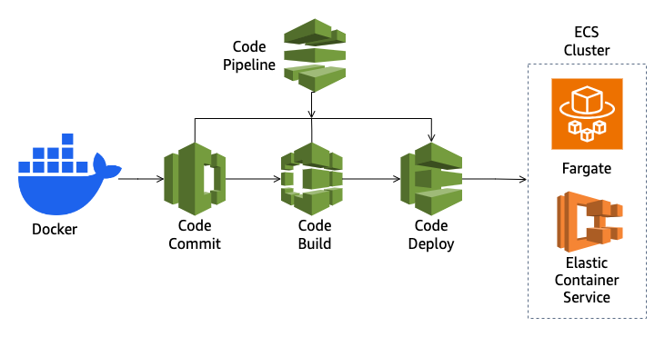
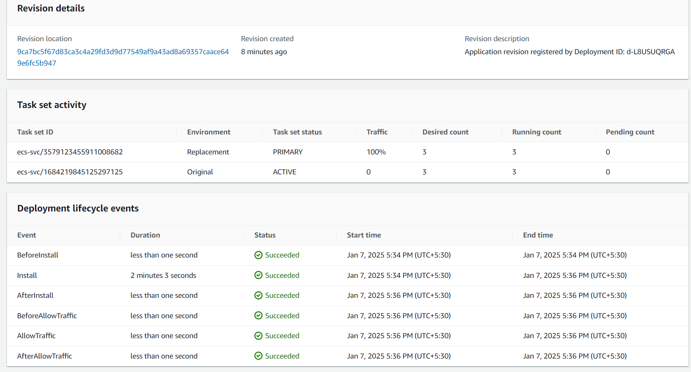
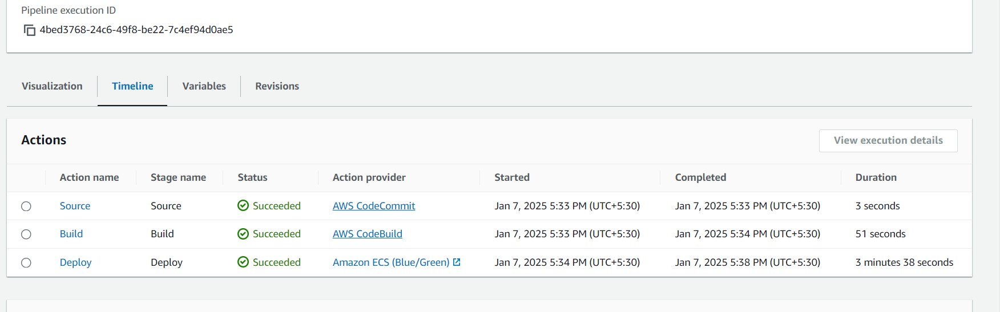

# Blue-Green Deployment for Node Application in ECS

This project demonstrates a blue-green deployment strategy for a Node.js application using AWS services including ECS, CodeCommit, CodeBuild, CodeDeploy, and CodePipeline.

## Overview

Blue-green deployment is a technique that reduces downtime and risk by running two identical production environments called Blue and Green. At any time, only one of the environments is live, with the live environment serving all production traffic. For this project, the Blue environment is the current live version serving traffic, and the Green environment is a new version to be released.

By using ECS (Elastic Container Service), we can define our application in a Docker container and then deploy it to safely switch traffic between two identical environments.





Here's how each service helps in the blue-green deployment process:

- **AWS CodeCommit**: Used to store the source code of the Node.js application. This can also be replaced by other source control tools like GitHub or GitLab.
- **AWS CodeBuild**: Builds the Docker image of the application and pushes it to AWS ECR (Elastic Container Registry).
- **AWS CodeDeploy**: Manages the deployment process, allowing a switch from blue to green environment without downtime.
- **AWS CodePipeline**: Orchestrates the workflow that integrates CodeCommit, CodeBuild, and CodeDeploy to enable continuous integration and delivery.

## Pre-requisites

1. AWS Account.
2. Docker installed on your local machine.
3. AWS CLI installed and configured.

## Setup Guide

### Step 1: Set up Source Control

Fork or clone this repository using AWS CodeCommit or another source control tool:

```bash
git clone <repository-url>
```

### Step 2: Build Docker Image

This project is configured to use AWS CodeBuild which will automatically build the Docker image from the `Dockerfile` present in the repository and push it to ECR.

Configure CodeBuild project to link it to your repository and specify build specifications in `buildspec.yaml`.

### Step 3: Push to ECR

Ensure CodeBuild is set up to push the Docker image to your ECR repository. Use the following AWS CLI commands to create a repository:

```bash
aws ecr create-repository --repository-name node-app --region us-east-1
```

### Step 4: Set up ECS

Create an ECS cluster and define an ECS service with a task definition(`taskdef.json`) that refers to the Docker image in ECR.

### Step 5: Configure CodeDeploy

Set up CodeDeploy to manage the deployment of the new image from the ECR to the ECS service. CodeDeploy will automate the process of launching new tasks with the new image and terminating the old tasks. Define scripts in `appspec.yaml`


### Step 6: Set up CodePipeline

Create a CodePipeline that integrates CodeCommit, CodeBuild, and CodeDeploy:

1. **Source Stage**: Triggered when a change is pushed to the source repository.
2. **Build Stage**: Builds the Docker image and pushes it to ECR.
3. **Deploy Stage**: Deploy the new image to ECS using CodeDeploy.

Through CodePipeline's simple console, you can visualize and manage the flow of updates through each stage.


## Conclusion

By following these setup steps, you have created a robust pipeline for blue-green deployments for a Node.js application on ECS using Docker and AWS services. This approach minimizes downtime during application feature updates and improves rollback capabilities in production environments.